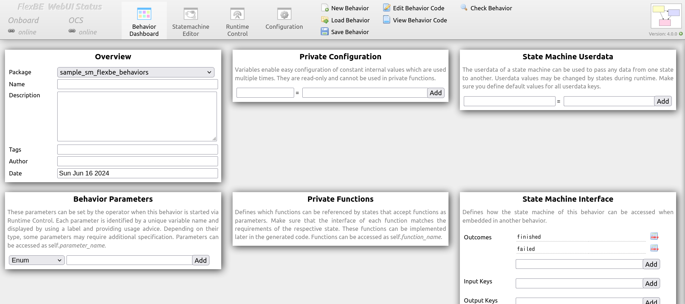
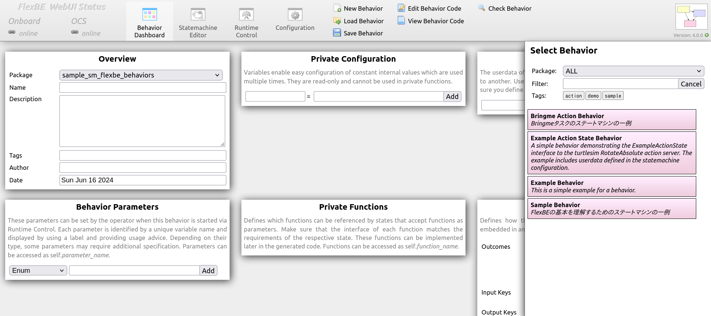
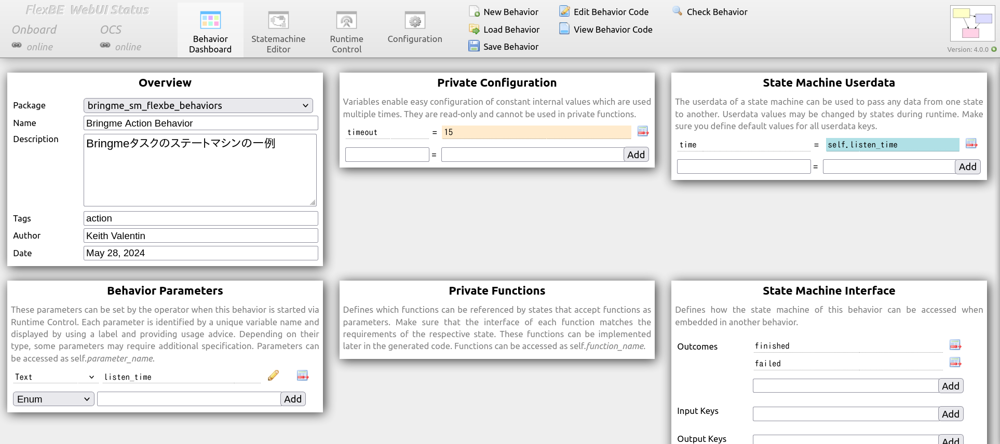
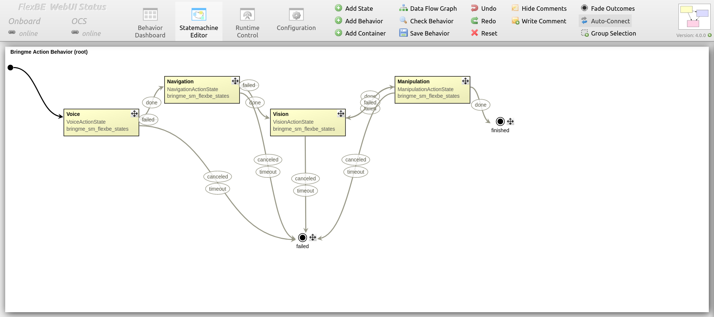
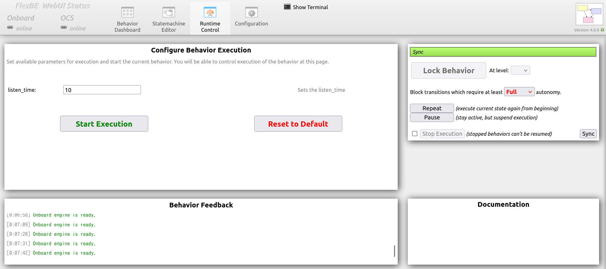
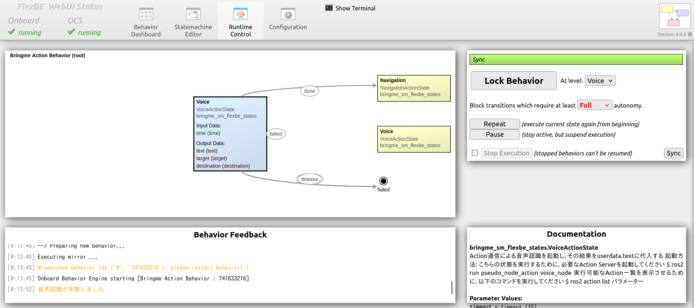
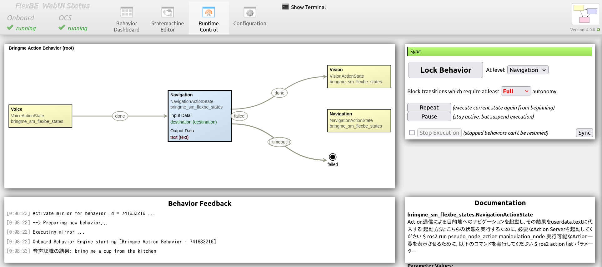
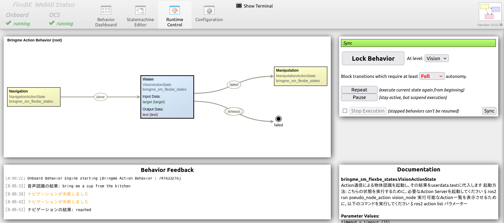
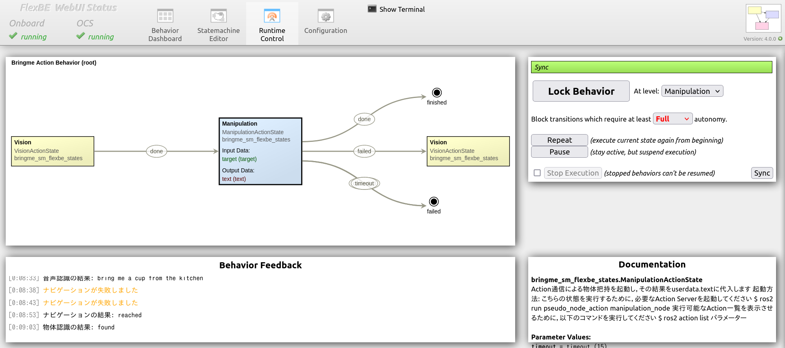

# bringme_sm_flexbe

7.4節のサンプルプログラム  
Bring meタスクのためのFlexBEによるステートマシンのプログラム


## 実行

1. Bringmeタスクのための必要なActionServerを実行するために，[bringme_nodes.launch.py](../pseudo_node_action/launch/bringme_nodes.launch.py)というlaunchファイルを実行します．
  ```console
  $ ros2 launch pseudo_node_action bringme.launch.py
  ```

2. `FlexBE App`を実行します．
  ```console
  $ ros2 launch flexbe_app flexbe_full.launch.py
  ```

> [!NOTE]
> `FlexBe App`が起動されない場合は，`nwjs`がインストールされていない可能性があります．
その際，`ros2 run flexbe_app nwjs_install`を実行してください．

<!-- 
2. `FlexBE WebUI`を実行します．
  ```console
  $ ros2 launch flexbe_webui flexbe_full.launch.py

> [!NOTE]
> `FlexBe WebUI`が起動されない場合は，依存関係のインストールされていない可能性があります．
その際，`pip3 install -r ~/airobot_ws/src/flexbe_webui/requires.txt`を実行してください．
  ``` -->

3. `Behavior Dashboard`が表示されます．


4. `Load Behavior`を押し，右側にBehavior一覧が表示されます．


5. その中から，`Bringme Action Behavior`というBehaviorを選択します．


6. `Statemachine Editor`に移動して，ステートマシンの状態を確認します．


7. `Runtime Control`に移動して，ステートマシンを実行します．
そのために，まず`listen_time`という値を設定します．

> [!NOTE]
> `listen_time`は音声認識の起動時間のことを表します．その値を自由に変えられます．



7. 次に，`Start Execution`を押して，状態が開始されます．

| Voiceステート | Navigationステート |
| --- | --- |
|  |  |

| Visionステート | Manipulationステート |
| --- | --- |
|  |  |

8. 実行ターミナルの結果の一例．
  ```console
  [00:37:59] Onboard engine is ready.
  [00:38:00] --> Mirror - received updated structure with checksum id = 741633216
  [00:38:00] Activate mirror for behavior id = 741633216 ...
  [00:38:00] --> Preparing new behavior...
  [00:38:00] Executing mirror ...
  [00:38:00] Onboard Behavior Engine starting [Bringme Action Behavior : 741633216]
  [00:38:11] 音声認識の結果: bring me a cup from the kitchen
  [00:38:15] ナビゲーションが失敗しました
  [00:38:18] ナビゲーションが失敗しました
  [00:38:28] ナビゲーションの結果: reached
  [00:38:38] 物体認識の結果: found
  [00:38:39] 物体把持が失敗しました
  [00:38:49] 物体認識の結果: found
  [00:38:59] 物体把持の結果: reached
  [00:38:59] PreemptableStateMachine 'Bringme Action Behavior' spin() - done with outcome=finished
  [00:39:00] No behavior active.
  [00:39:00] Onboard engine is ready.
  [00:39:00] --- Behavior Mirror ready! ---
  [00:39:10] Onboard engine is ready.
  ```


## Statesの一覧

* [voice_action_state.py](bringme_sm_flexbe_states/bringme_sm_flexbe_states/voice_action_state.py):
  * 音声認識の状態の実装

* [navigation_action_state.py](bringme_sm_flexbe_states/bringme_sm_flexbe_states/navigation_action_state.py):
  * ナビゲーションの状態の実装

* [vision_action_state.py](bringme_sm_flexbe_states/bringme_sm_flexbe_states/vision_action_state.py):
  * 物体認識の状態の実装

* [manipulation_action_state.py](bringme_sm_flexbe_states/bringme_sm_flexbe_states/manipulation_action_state.py):
  * 物体把持の状態の実装

## Behaviorsの一覧

* [bringme_action_behavior_sm.py](bringme_sm_flexbe_behaviors/bringme_sm_flexbe_behaviors/bringme_action_behavior_sm.py):
  * 音声認識・ナビゲーション・物体認識・物体把持の状態を含めたBringmeタスクのためのステートマシン 
