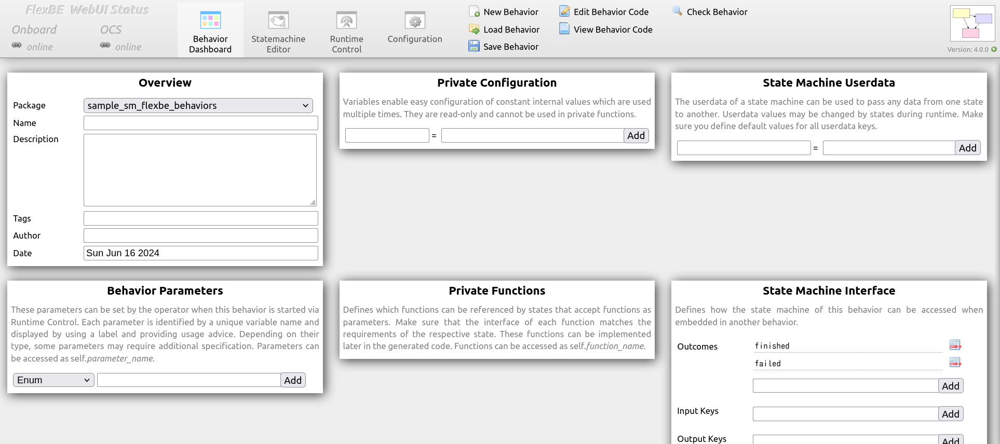
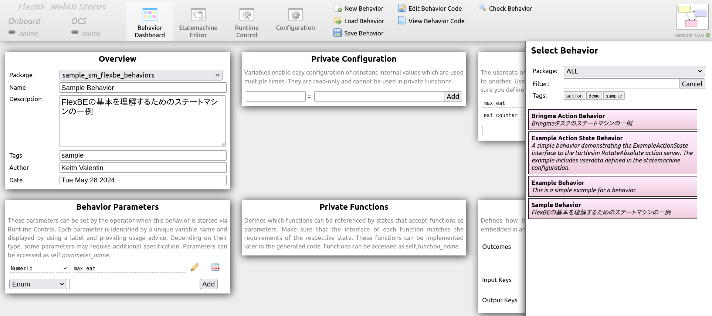
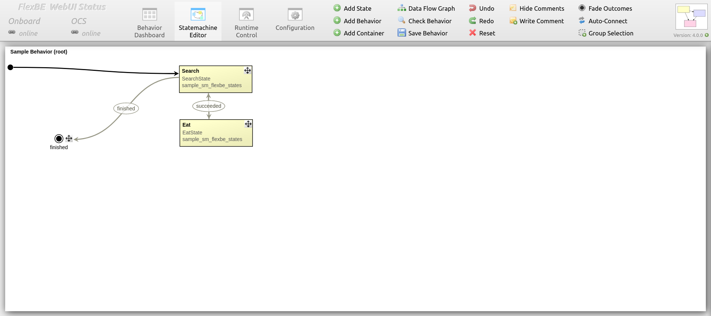
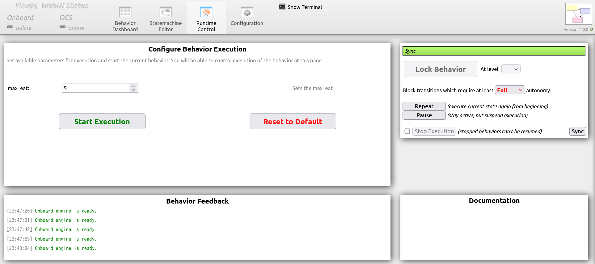
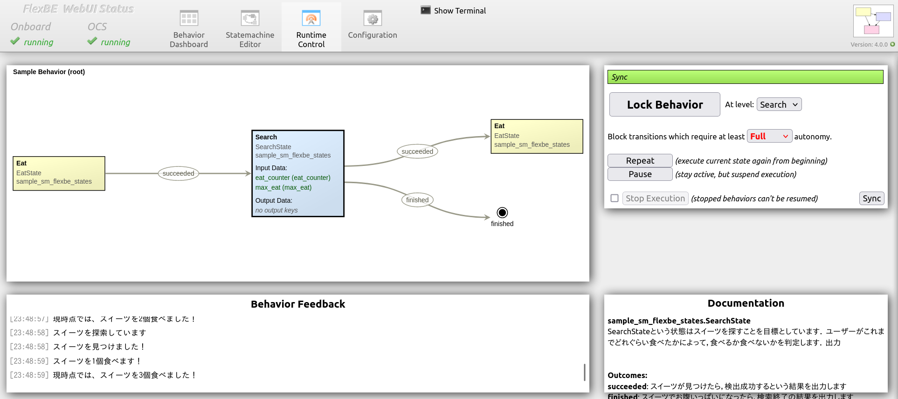
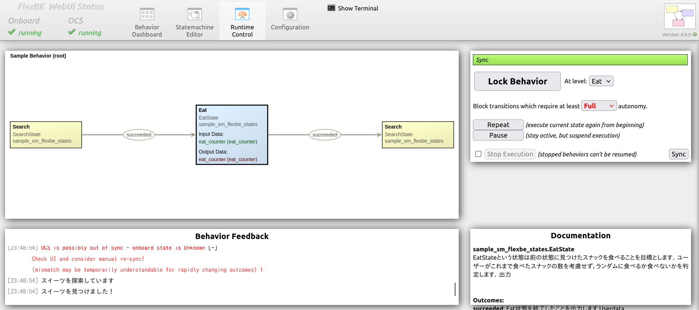

# sample_sm_flexbe

7.3節のサンプルプログラム  
FlexBEによる二状態のステートマシンのプログラム


## 実行

1. `FlexBE WebUI`を実行します．
  ```console
  $ ros2 launch flexbe_webui flexbe_full.launch.py
  ```

> [!NOTE]
> `FlexBe WebUI`が起動されない場合は，依存関係のインストールされていない可能性があります．
その際，`flexbe_webui`のフォルダーの中で，`pip3 install -r requires.txt`を実行してください．

2. `Behavior Dashboard`が表示されます．


3. `Load Behavior`を押し，右側にBehavior一覧が表示されます．


4. その中から，`Sample Behavior`というBehaviorを選択します．


5. `Statemachine Editor`に移動して，ステートマシンの状態を確認します．


6. `Runtime Control`に移動して，ステートマシンを実行します．
そのために，まず`max_eat`という値を設定します．

> [!NOTE]
> `max_eat`はユーザーが食べられるスイーツの数のことを表します．その値を自由に変えられます．



7. 次に，`Start Execution`を押して，状態が開始されます．

| Searchステート | Eatステート |
| --- | --- |
|  |  |

8. 実行ターミナルの結果の一例．
  ```console
  [00:50:45] Onboard engine is ready.
  [00:50:50] --> Mirror - received updated structure with checksum id = 551566305
  [00:50:50] Activate mirror for behavior id = 551566305 ...
  [00:50:50] --> Preparing new behavior...
  [00:50:50] Executing mirror ...
  [00:50:50] Onboard Behavior Engine starting [Sample Behavior : 551566305]
  [00:50:52] スイーツを探索しています
  [00:50:52] スイーツを見つけました！
  [00:50:53] スイーツを1個食べます！
  [00:50:53] 現時点では、スイーツを1個食べました！
  [00:50:54] スイーツを探索しています
  [00:50:54] スイーツを見つけました！
  [00:50:55] スイーツを1個食べます！
  [00:50:55] 現時点では、スイーツを2個食べました！
  [00:50:56] スイーツを探索しています
  [00:50:56] スイーツを見つけました！
  [00:50:57] スイーツを1個食べます！
  [00:50:57] 現時点では、スイーツを3個食べました！
  [00:50:58] スイーツを探索しています
  [00:50:58] スイーツを見つけました！
  [00:50:59] スイーツを1個食べます！
  [00:50:59] 現時点では、スイーツを4個食べました！
  [00:51:00] スイーツを探索しています
  [00:51:00] スイーツを見つけました！
  [00:51:01] スイーツを1個食べます！
  [00:51:01] 現時点では、スイーツを5個食べました！
  [00:51:02] スイーツを探索しています
  [00:51:02] もうお腹いっぱいです・・・
  [00:51:02] PreemptableStateMachine 'Sample Behavior' spin() - done with outcome=finished
  [00:51:02] No behavior active.
  [00:51:02] --- Behavior Mirror ready! ---
  ```


## Statesの一覧

* [search_state.py](sample_sm_flexbe_states/sample_sm_flexbe_states/search_state.py):
  * スナックを探す状態の実装

* [eat_state.py](sample_sm_flexbe_states/sample_sm_flexbe_states/eat_state.py):
  * 見つけたスナックを食べる状態の実装 


## Behaviorsの一覧

* [sample_behavior_sm.py](sample_sm_flexbe_behaviors/sample_sm_flexbe_behaviors/sample_behavior_sm.py):
  * 食べ物の探索と食事の状態を含めたSampleタスクのためのステートマシン
